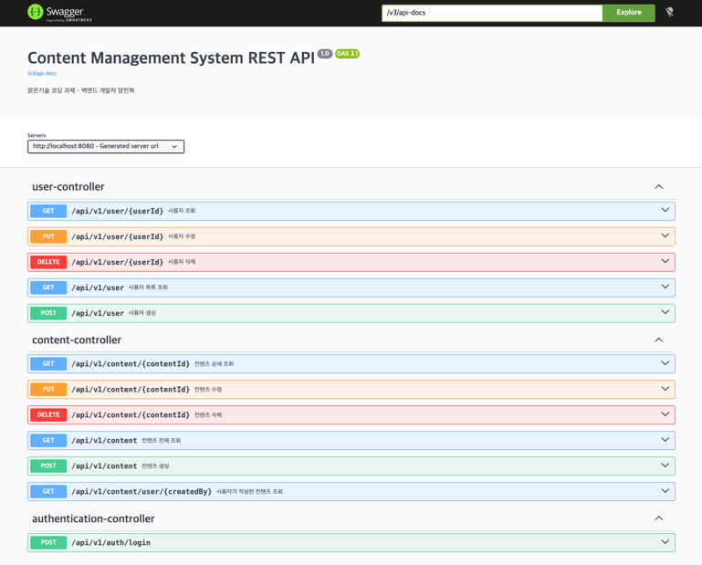

# 📚 프로젝트 구현 내용 정리

## 🎯 프로젝트 개요
- 2026 신입 Back-End 개발자 코딩 과제 - 간단한 CMS REST API
- (주)맑은기술 백엔드 서버 개발자(Java) 코딩 과제 제출용 레포지토리입니다.

## 🛠️ 개발 환경

- **Framework**: Spring Boot 4.0.3
- **Language**: Java 25
- **Build Tool**: Gradle 9.0.0
- **Database**: H2 (In-Memory)
- **ORM**: Spring Data JPA
- **Security**: Spring Security + JWT
- **API Documentation**: Swagger (SpringDoc OpenAPI 3.0.2)
- **Logging**: SLF4J
- **Annotation Processing**: Lombok

---

## 📁 프로젝트 구조

```
2026-cms-api/
├── src/main/
│   ├── java/com/malgn/
│   │   ├── controller/
│   │   │   ├── AuthenticationController.java
│   │   │   ├── UserController.java
│   │   │   └── ContentController.java
│   │   ├── service/
│   │   │   ├── UserService.java
│   │   │   ├── ContentService.java
│   │   │   ├── CmsUserDetailsService.java
│   │   ├── entity/
│   │   │   ├── User.java
│   │   │   ├── Content.java
│   │   │   └── Role.java
│   │   ├── dto/
│   │   │   ├── AuthenticationRequest/Response
│   │   │   ├── UserRequest/Response
│   │   │   └── ContentCreateRequest/UpdateRequest/Response
│   │   ├── repository/
│   │   │   ├── UserRepository.java
│   │   │   └── ContentRepository.java
│   │   ├── security/
│   │   │   ├── JwtUtil.java
│   │   │   ├── JwtRequestFilter.java
│   │   │   ├── JwtAuthenticationEntryPoint.java
│   │   │   ├── CmsUserDetails.java
│   │   │   └── CmsGrantedAuthority.java
│   │   ├── configure/
│   │   │   ├── AppConfiguration.java
│   │   │   └── security/SecurityConfiguration.java
│   │   ├── exception/
│   │   │   ├── GlobalExceptionHandler.java
│   │   │   ├── UserNotFoundException.java
│   │   │   ├── ContentNotFoundException.java
│   │   │   └── NotAuthorizedException.java
│   │   ├── util/
│   │   │   └── EntityDtoMapper.java
│   │   └── Application.java
│   └── resources/
│       ├── application.yml
│       └── db/sql/
│           ├── h2-schema.sql
│           └── h2-data.sql
└── src/test/
    └── java/com/malgn/
        ├── controller/ (6개 테스트 클래스)
        ├── service/ (2개 테스트 클래스)
        ├── entity/ (1개 테스트 클래스)
        └── exception/ (1개 테스트 클래스)
```

---

## 🎨 핵심 기능 구현

### 1️⃣ 사용자 인증 (JWT 기반)

**AuthenticationController** (`/api/v1/auth`)
- **POST /login**: 사용자명과 비밀번호로 로그인 → JWT 토큰 반환
  - 요청: `{ username, password }`
  - 응답: `{ jwt }`

**JWT 관리** (JwtUtil.java)
- HMAC-SHA 기반 JWT 생성/검증
- 토큰 유효시간: 5시간 (JWT_VALIDITY = 18000초)
- Claims에 userId 포함

**JwtRequestFilter**
- 모든 요청의 Authorization 헤더에서 JWT 추출
- 토큰 검증 후 SecurityContext에 인증 정보 저장

---

### 2️⃣ 사용자 관리 (RBAC 권한 제어)

**UserController** (`/api/v1/user`)
- **GET /**: 모든 사용자 목록 (누구나 접근)
- **GET /{userId}**: 사용자 상세 조회 (누구나 접근)
- **POST /**: 사용자 생성/회원가입 (누구나 접근)
- **PUT /{userId}**: 사용자 정보 수정 (인증 필요)
  - 일반 사용자는 본인 정보만 수정 가능
  - 관리자는 모든 사용자 정보 수정 가능
- **DELETE /{userId}**: 사용자 삭제 (ADMIN만 접근)

**UserService** 구현
- 사용자 CRUD 작업
- username 중복 검사
- "admin" 계정은 자동으로 ROLE_ADMIN 부여
- 권한 기반 접근 제어 (NotAuthorizedException 발생)
- @Transactional로 트랜잭션 관리

**User 엔티티**
```
- id: 자동 증가 PK
- username: 유니크, 최대 50자
- password: BCrypt로 인코딩 저장
- roles: Set<Role> (ROLE_ADMIN, ROLE_USER)
- contents: 작성한 컨텐츠 목록
- createdDate: 생성 날짜 (자동)
- lastModifiedDate: 수정 날짜 (자동)
```

---

### 3️⃣ 컨텐츠 관리 (작성자 권한 검증)

**ContentController** (`/api/v1/content`)
- **POST /**: 컨텐츠 생성 (인증 필요)
- **GET /**: 전체 컨텐츠 조회 (페이징 지원, 누구나 접근)
- **GET /{contentId}**: 특정 컨텐츠 조회 (누구나 접근)
- **GET /user/{createdBy}**: 특정 작성자의 컨텐츠 조회 (페이징, 누구나 접근)
- **PUT /{contentId}**: 컨텐츠 수정 (인증 필요)
  - 작성자 또는 관리자만 수정 가능
- **DELETE /{contentId}**: 컨텐츠 삭제 (인증 필요)
  - 작성자 또는 관리자만 삭제 가능

**ContentService** 구현
- 컨텐츠 CRUD 작업
- 페이지네이션 지원 (기본 정렬: 최신순)
- 부분 업데이트 지원 (null 필드는 기존 값 유지)
- 작성자 권한 검증
- @Transactional(isolation = Isolation.REPEATABLE_READ)로 동시성 제어

**Content 엔티티**
```
- id: 자동 증가 PK
- title: 제목 (최대 100자)
- description: 본문 (TEXT)
- viewCount: 조회수 (기본값 0)
- createdBy: 작성자명
- lastModifiedBy: 수정자명
- createdDate: 생성 날짜 (자동)
- lastModifiedDate: 수정 날짜 (자동)
```

---

### 4️⃣ 입력값 검증 (Bean Validation)

**Request DTO 검증**
```java
- UserRequest: @NotBlank username, password
- ContentCreateRequest: @NotBlank title, createdBy
- 등등...
```

**GlobalExceptionHandler**
- `UserNotFoundException` → 404 NOT_FOUND
- `ContentNotFoundException` → 404 NOT_FOUND
- `NotAuthorizedException` → 403 FORBIDDEN
- `IllegalArgumentException` → 400 BAD_REQUEST
- `MethodArgumentNotValidException` → 400 BAD_REQUEST (검증 실패)

---

### 5️⃣ Spring Security 설정 (SecurityConfiguration)

**엔드포인트별 접근 제어**
```
✅ 누구나 접근
- /api/v1/auth/login
- POST /api/v1/user (회원가입)
- GET /api/v1/user, /api/v1/user/* (조회)
- Swagger 문서 (/swagger-ui/**, /v3/api-docs/**)

🔒 인증 필요
- PUT /api/v1/user/* (자신의 정보 수정)
- POST /api/v1/content
- PUT /api/v1/content/*
- DELETE /api/v1/content/*
- 기타 모든 요청

🔐 ADMIN만
- DELETE /api/v1/user/*
```

**기타 설정**
- SessionCreationPolicy: STATELESS (JWT 기반이므로 세션 불필요)
- CSRF 비활성화 (REST API)
- CORS 비활성화
- Method Security: @PreAuthorize, @PostAuthorize 지원

---

### 6️⃣ 데이터베이스 (H2 In-Memory)

**테이블 스키마**

```sql
members (사용자)
├── id (BIGINT AUTO_INCREMENT PK)
├── username (VARCHAR(50) UNIQUE NOT NULL)
├── password (VARCHAR(255) NOT NULL)
├── created_date (TIMESTAMP DEFAULT CURRENT_TIMESTAMP)
└── last_modified_date (TIMESTAMP)

user_roles (사용자 권한)
├── user_id (BIGINT FK → members)
└── role (VARCHAR(255) - ROLE_ADMIN, ROLE_USER)

contents (컨텐츠)
├── id (BIGINT AUTO_INCREMENT PK)
├── title (VARCHAR(100) NOT NULL)
├── description (TEXT)
├── view_count (BIGINT DEFAULT 0)
├── created_date (TIMESTAMP NOT NULL)
├── last_modified_date (TIMESTAMP)
├── created_by (VARCHAR(50) NOT NULL)
└── last_modified_by (VARCHAR(50))
```

**초기 데이터**
- 사용자: bob (ROLE_USER)

---

## 🧪 테스트 (11개 클래스)

### 엔티티 테스트
- **UserEntityTest**: User 빌더, 권한 부여, 비밀번호 인코딩

### 컨트롤러 테스트
- **AuthenticationControllerTest**: 로그인 엔드포인트
- **UserControllerTest**: 사용자 CRUD 및 권한 검증
- **ContentControllerTest**: 컨텐츠 CRUD

### 서비스/예외 테스트
- **UserServiceTest**: 권한 기반 사용자 수정
- **ContentServiceTest**: 컨텐츠 CRUD 및 권한 검증
- **ExceptionHandlerTest**: 예외 처리

### 통합 테스트
- **ValidationTest**: 입력값 검증
- **PagingTest**: 페이지네이션
- **PartialUpdateTest**: 부분 업데이트
- **ApplicationTests**: 애플리케이션 부트스트랩

---

## 🚀 실행 방법

### 1. 빌드
```bash
./gradlew build
```

### 2. 실행
```bash
./gradlew bootRun
```

### 3. 서버 시작
```
http://localhost:8080
```

### 4. Swagger UI 접근
```
http://localhost:8080/swagger-ui.html
```

### 5. H2 콘솔
```
http://localhost:8080/h2-console
```

---

## 📝 API 사용 예시

### 1️⃣ 로그인
```bash
POST http://localhost:8080/api/v1/auth/login
Content-Type: application/json

{
  "username": "bob",
  "password": "test123"  # h2-data.sql의 bob의 비밀번호와 일치해야 함
}

응답:
{
  "jwt": "eyJhbGc..."
}
```

### 2️⃣ 사용자 생성
```bash
POST http://localhost:8080/api/v1/user
Content-Type: application/json

{
  "username": "john",
  "password": "password123"
}

응답:
{
  "id": 2,
  "username": "john",
  ...
}
```

### 3️⃣ 컨텐츠 생성 (인증 필요)
```bash
POST http://localhost:8080/api/v1/content
Authorization: Bearer {jwt_token}
Content-Type: application/json

{
  "title": "첫 번째 게시물",
  "description": "내용입니다",
  "createdBy": "john"
}
```

### 4️⃣ 컨텐츠 조회 (페이징)
```bash
GET http://localhost:8080/api/v1/content?page=0&size=10
```

---

## 🔐 권한 체계

### ROLE_USER (일반 사용자)
- ✅ 회원가입, 로그인
- ✅ 자신의 정보 조회/수정
- ✅ 컨텐츠 생성/조회
- ✅ 자신의 컨텐츠 수정/삭제
- ❌ 다른 사용자 정보 수정
- ❌ 다른 사용자 컨텐츠 수정/삭제

### ROLE_ADMIN (관리자)
- ✅ 모든 사용자 정보 조회/수정
- ✅ 모든 사용자 삭제
- ✅ 모든 컨텐츠 수정/삭제
- ✅ 기타 모든 작업

---

## 🤖AI 활용 및 참고 자료

### AI 활용

- Gemini: 시스템 설계 및 의존성 버전 확인
- Github Copilot: 테스트코드 작성 및 기존 코드 리팩토링

### 참고 자료

- [WebMvcTest](https://docs.spring.io/spring-boot/api/java/org/springframework/boot/webmvc/test/autoconfigure/WebMvcTest.html) 스프링 공식 문서

---

## 🔖 API 문서

